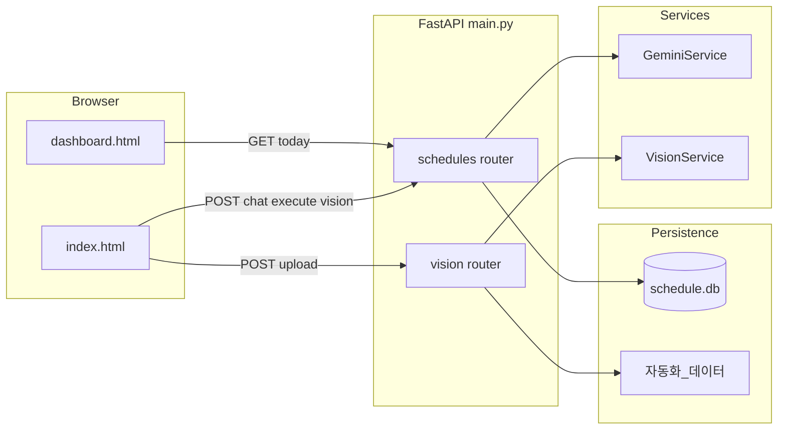

# yjs_Dashboard 저장소 전체 기획안

## 1. 제품 목적 (한 줄)

**현장 작업자가 자연어(채팅)로 일정을 등록·수정·삭제·조회하고, 작업일지 등 이미지를 업로드하면 AI가 분류·추출해 파일로 저장하며, 상황판 HTML이 SQLite 일정을 주기적으로 갱신해 보여주는 내부용 웹 앱.**

---

## 2. 기술 스택

| 구분  | 선택                                                                                                                                                                                                                                                                                             |
| --- | ---------------------------------------------------------------------------------------------------------------------------------------------------------------------------------------------------------------------------------------------------------------------------------------------- |
| 백엔드 | Python, **FastAPI**, Pydantic v2, `pydantic-settings`                                                                                                                                                                                                                                          |
| DB  | **SQLite** (`schedule.db`), `sqlite3` 직접 사용                                                                                                                                                                                                                                                    |
| AI  | **Google GenAI** (`google.genai`), 모델명 `gemini-3-flash-preview` ([`app/services/ai_service.py`](../app/services/ai_service.py), [`app/services/vision_ai_service.py`](../app/services/vision_ai_service.py)) |
| 프론트 | 루트의 **정적 HTML** + Bootstrap 5 CDN + 인라인 JS ([`index.html`](../index.html), [`dashboard.html`](../dashboard.html))                                                                                            |
| 기타  | 비전 업로드 후 **pandas**로 xlsx 저장 ([`app/api/vision.py`](../app/api/vision.py))                                                                                                                                                                                |

앱 진입점은 **저장소 루트의** [`main.py`](../main.py)입니다 (주석에는 `app/main.py`로 적혀 있으나 실제 파일 위치는 루트).

---

## 3. 디렉터리·역할 맵 (수정할 때 찾기 쉬운 표)

| 경로                                                                                                                   | 역할                                                          |
| -------------------------------------------------------------------------------------------------------------------- | ----------------------------------------------------------- |
| [`main.py`](../main.py)                                                     | FastAPI 앱 생성, CORS, 라우터 마운트, `/`·`/dashboard.html` 정적 파일 서빙 |
| [`app/api/schedules.py`](../app/api/schedules.py)                           | 일정 API: `/chat`, `/execute`, `/today`                       |
| [`app/api/vision.py`](../app/api/vision.py)                                 | 이미지 업로드·분석·`자동화_데이터/` 저장                                    |
| [`app/db/db_manager.py`](../app/db/db_manager.py)                           | `field_schedules` 테이블 CRUD/검색, 마이그레이션성 `ALTER`              |
| [`app/services/ai_service.py`](../app/services/ai_service.py)               | 자연어 → 의도·JSON 스키마 (`ActionSchema`, `ScheduleSchema`)        |
| [`app/services/vision_ai_service.py`](../app/services/vision_ai_service.py) | 이미지 → 문서종류·ERP용 필드 JSON                                     |
| [`app/core/config.py`](../app/core/config.py)                               | `.env` 기반 설정 (`GEMINI_API_KEY`, `DATABASE_URL`)             |
| [`index.html`](../index.html)                                               | 채팅 UI, `/api/schedules/`*, `/api/vision/upload` 호출          |
| [`dashboard.html`](../dashboard.html)                                       | 상황판 UI, `/api/schedules/today` 폴링(30초)                      |
| `schedule.db`                                                                                                        | 런타임 SQLite (`.gitignore`에 `*.db`)                           |
| `자동화_데이터/`                                                                                                           | 비전 파이프라인 결과물(문서종류별 폴더, xlsx·원본 이미지)                         |

`app/` 아래에 `__init__.py`가 없어도 Python 3에서 패키지로 import 되는 환경에서 동작하도록 구성된 형태입니다.

---

## 4. 엔드포인트 요약

| Method | Path                     | 처리 모듈          | 설명                                           |
| ------ | ------------------------ | -------------- | -------------------------------------------- |
| GET    | `/`                      | `main.py`      | `index.html`                                 |
| GET    | `/dashboard.html`        | `main.py`      | `dashboard.html`                             |
| POST   | `/api/schedules/chat`    | `schedules.py` | Gemini 의도 분석 + (필요 시) DB 후보 검색, **DB 변경 없음** |
| POST   | `/api/schedules/execute` | `schedules.py` | 사용자 확인 후 create/update/delete **실제 반영**      |
| GET    | `/api/schedules/today`   | `schedules.py` | 상황판용 일정 목록 (최대 50건)                          |
| POST   | `/api/vision/upload`     | `vision.py`    | 이미지 분석 후 디스크 저장                              |

OpenAPI는 FastAPI 기본 (`/docs` 등)으로 노출 가능.

---

## 4.1 앱 라이프사이클/백그라운드 작업

- 앱 생명주기는 FastAPI `lifespan`으로 관리한다 ([`main.py`](../main.py)).
- 시작 시 `daily_export_loop` 백그라운드 태스크를 생성해 전일 업로드 필요 여부를 주기 점검한다.
- 종료 시 해당 태스크를 cancel하고 `CancelledError`를 안전하게 무시해 정상 종료한다.

---

## 5. 데이터·제어 흐름 (다이어그램)

**대화형 일정(V2) 패턴:** `chat`에서 `intent`·`candidates`·`schedule_data`만 돌려주고, 사용자가 카드에서 확인하면 `execute`로 한 번 더 호출해 DB를 바꿉니다. 삭제는 후보의 `id`로 `delete_schedule_by_id`를 호출합니다.

---

## 6. 데이터 모델

### 6.1 SQLite `field_schedules` (`db_manager._init_db` in [`app/db/db_manager.py`](../app/db/db_manager.py))

- `id`, `date`, `location`, `task`, `person`, `details`, `tags`, `category`, `created_at`
- **Upsert 규칙:** 동일 `(date, location)`이 있으면 UPDATE, 없으면 INSERT (`upsert_schedule`)

### 6.2 AI가 다루는 일정 스키마 (`ScheduleSchema` in [`app/services/ai_service.py`](../app/services/ai_service.py))

- 날짜·위치·작업·담당·상세·태그 리스트·카테고리(공사일정/이슈보고/일반메모 등)

### 6.3 비전 분석 스키마 (`AnalysisResult` in [`app/services/vision_ai_service.py`](../app/services/vision_ai_service.py))

- 문서 종류, 공사명/코드, 작업일, 야간 여부, 인원·장비 수치 등 → 작업일지인 경우 xlsx 한 행으로 변환

---

## 7. 환경 변수 ([`app/core/config.py`](../app/core/config.py))

- **필수:** `GEMINI_API_KEY`, `DATABASE_URL` (Pydantic Settings 상 필수 필드로 선언됨)
- **실사용:** 일정 경로는 `DATABASE_URL`에서 파생된 SQLite 경로를 사용한다 (예: `sqlite:///schedule.db`).

`.env`는 [`.gitignore`](../.gitignore)에 포함.

---

## 8. 프론트엔드와 API 계약 (개조 시 체크포인트)

- [`index.html`](../index.html): `POST /api/schedules/chat` body `{ text }`; `POST /api/schedules/execute` body `{ action, schedule_data?, schedule_id? }`; `POST /api/vision/upload` `FormData` 필드명 `file`.
- [`dashboard.html`](../dashboard.html): `GET /api/schedules/today` → 응답의 `data` 배열을 날짜별 그룹으로 렌더. 우측 “외출/행선표”, “이달의 공지”는 **하드코딩 HTML**이라 API와 무관.

---

## 9. 현재 코드베이스 특이사항·기술 부채 (개조 전에 알면 좋은 것)

1. **`get_todays_schedules`의 쿼리 파라미터 `date`**: 라우터는 `date`를 넘기지만, [`get_all_schedules_desc`](../app/db/db_manager.py)는 SQL에서 `target_date`를 **사용하지 않음** (주석에도 “날짜 필터 없음”). “오늘만 보기” 등을 원하면 DB 레이어·API를 맞춰야 함.
2. **CORS `allow_origins=["*"]`**: 배포 시 보안·도메인 정책을 다시 잡을 여지가 있음 ([`main.py`](../main.py)).
3. **의존성 목록**: 루트에 `requirements.txt`를 두고 배포 환경을 고정하는 것을 권장.

---

## 10. “이 방향으로 바꿀 때” 빠른 찾기 가이드

| 바꾸고 싶은 것             | 우선 볼 파일                                                                                                                                                                                                    |
| -------------------- | ---------------------------------------------------------------------------------------------------------------------------------------------------------------------------------------------------------- |
| AI 말투·의도 분류·필드 정의    | [`app/services/ai_service.py`](../app/services/ai_service.py) (시스템 프롬프트, `ActionSchema` / `ScheduleSchema`)                                                       |
| 일정 API URL·검증·응답 형식  | [`app/api/schedules.py`](../app/api/schedules.py)                                                                                                                 |
| 테이블 스키마·쿼리·Upsert 규칙 | [`app/db/db_manager.py`](../app/db/db_manager.py)                                                                                                                 |
| 이미지 분류·추출 필드·저장 규칙   | [`app/services/vision_ai_service.py`](../app/services/vision_ai_service.py), [`app/api/vision.py`](../app/api/vision.py) |
| 채팅/상황판 UI·폴링 주기      | [`index.html`](../index.html), [`dashboard.html`](../dashboard.html)                                                     |
| 라우트 추가·CORS·정적 경로    | [`main.py`](../main.py)                                                                                                                                           |
| 환경 변수·배포 설정          | [`app/core/config.py`](../app/core/config.py) + `.env`                                                                                                            |

이 문서는 저장소의 아키텍처·기술 부채 지도로 유지합니다. 동작이나 경로가 크게 바뀌면 함께 갱신하세요.

---

## 11. vNext 발전 기획안 (1~4차 통합)

### 11.1 목표

현장 사용자가 쉬운 입력 방식으로 데이터를 남기고, AI는 보조 역할에 집중하며, 최종 변경은 관리자 승인 정책으로 안전하게 운영한다.

### 11.2 제품 원칙

- **사용성 우선**: 비 IT 사용자 기준의 단순 UX(큰 버튼, 카테고리 선택, 확인 카드)
- **정확성 우선**: `id` 기반 변경, 중복 방지, 관리자 승인 큐
- **운영 단순화**: 1인 개발자 유지보수 가능한 단일 앱 구조
- **일별 보관**: 날짜 기준으로 Drive/xlsx 자동 업로드

### 11.3 인증/접근 정책

- 로그인은 **DB `id/pw`** 방식 사용
- 식별자는 **등록 코드(register code)** 기반
- 미등록 기기에서 앱 실행 시 `"미등록 기기입니다"` 메시지 후 클라이언트 종료
- 서버의 접근 차단 로직은 최소화하고, 비정상 패킷은 서버 검증 로직으로 방어

### 11.4 AI 권한 및 채팅 정책

- AI는 **일정 등록(create), 조회(search), 요약 생성** 중심으로 사용
- 수정/삭제는 채팅에서 즉시 반영하지 않고 **관리자 승인 큐**로 전송
- 해석 불가 채팅은 `unclassified`로 저장 후 관리자 처리
- 채팅 내역은 `daily_reset + recent 8~12` 권장
- 비용/지연 임계치 초과 시:
  - `"현재 AI를 사용할 수 없습니다. 관리자에게 문의해주세요"` 안내 출력

### 11.5 채팅 입력 카테고리

모바일/PC 채팅창 하단에서 카테고리 선택 후 전송:

- `공사 일정 등록` (기본값)
- `메모`
- `기타(관리자에게 전송)`

처리 규칙:

- `공사 일정 등록`, `메모`: AI 분석 후 등록 플로우
- `기타(관리자에게 전송)`: 관리자 `unclassified` 탭으로 전송
- 모바일 채팅 UI에서 `수정`, `삭제` 카테고리는 노출/사용하지 않음(비활성)

### 11.6 디바이스별 UX

- **모바일**: 개인 채팅 중심, 등록/수정요청/삭제요청 + 대시보드 조회
- **PC**: 채팅 + 대시보드 동시 사용, 등록/조회/수정요청/삭제요청
- **LG Create Board**:
  - 채팅창 없음, 상황판 상시 출력
  - 카드 상태 UI 클릭 시 템플릿 입력창으로 조작
  - 사용자 식별 불가 시 변경자 표시는 `"전자칠판"`

### 11.7 일정/메모/외출 도메인 규칙

- 일정은 `start_date`, `end_date`로 연속 공사 표현
- 날짜 메모/공사 메모는 `memo_items` 단일 테이블 + `linked_schedule_id` 링크 방식
- 외출 상태는 `사무실(기본) / 외출 / 야간작업` 3종 유지
- 외출 만료 시 자동 복귀, 관리자 강제 상태 변경 시 기존 외출 상태 종료

### 11.8 중복 및 삭제 제어

- 중복 방지 2단계:
  1. 정규화 키 비교(날짜 범위, 현장명, 카테고리)
  2. 유사도 점수(`task/details`)
- **현재 운영 정책**: AI 신뢰도 이슈로 임계값 기반 자동 차단/병합은 사용하지 않고, 일단 모두 등록/요청 처리
- **향후 활성화용 메모**: 임계값 로직은 코드에 주석/비활성 상태로 보관 후, 안정화 시 재활성화
- 삭제는 기본 소프트 삭제(`deleted_at`, `deleted_by`, `delete_reason`)
- 하드 삭제는 관리자 페이지에서만 수행

### 11.9 사진 전송 기능 (4차)

- 대상: **모바일/PC 채팅창**
- 흐름:
  1. `사진 전송` 클릭
  2. `"어떤 사진을 전송하시겠습니까?"` 안내 + 카테고리 선택
  3. 예: `TBM 문서`, `공사 일지 문서`, `영수증`, `미분류류` (추후 확장)
  4. 사진 첨부 후 전송
- 저장:
  - 대시보드에는 이미지 미표시
  - 카테고리별 폴더에 자동 저장 (`YYYY-MM-DD/<category>/...`)
  - `photo_uploads` 메타데이터 저장 (`category`, `file_path`, `uploaded_by`, `uploaded_device`, `uploaded_at`, `related_date`)
- 관리자 페이지에서 카테고리/날짜/업로더 기준 검색 및 다운로드 지원

### 11.10 데이터 저장/이력 추적/일별 업로드

- 모든 등록/수정/삭제요청/상태변경에 최종 변경자 기록:
  - `last_actor_user`, `last_actor_device`, `last_actor_at`
- 날짜 변경 시 전일 데이터 자동 업로드:
  - 공사일정
  - 기타메모
  - 인원별 외출
  - 야간작업 시작/종료 시각

### 11.11 연속 공사 데이터 규칙 (확정)

- 기본 모델은 1건의 공사를 `start_date ~ end_date` 단일 레코드로 관리
- 기간 내 일부 날짜만 내용이 달라지면, 원본 공사를 기준으로 **예외(override) 레코드**를 별도 생성
- 예외 레코드는 `parent_schedule_id`로 원본과 연결하고, 대상 날짜(`override_date`)에만 우선 적용
- 조회 우선순위:
  1. 해당 날짜의 예외 레코드
  2. 없으면 원본 기간 레코드
- 기간 변경 시 정책:
  - 기간 축소: 범위 밖 예외 레코드는 자동 종료(soft close)
  - 기간 확대: 기존 원본을 유지하고 필요한 날짜에만 예외 추가
- 삭제 정책:
  - 원본 소프트 삭제 시 연결된 예외도 함께 soft delete
  - 예외 단독 삭제는 가능하며 원본에는 영향 없음

### 11.12 외출/야간 상태 충돌 규칙 (확정)

- 상태 우선순위 원칙: **사용자 수동 조작(또는 관리자 수동 조작) > 자동 처리 이벤트**
- 충돌 발생 시 **가장 최근에 들어온 수동 상태**를 최종 상태로 유지
- 자동 외출 만료(자동복귀)는 항상 `사무실`로 전환
- 자동복귀 시점에 이전 상태가 `야간작업`이었더라도 예외 없이 `사무실`로 확정
- 자동 이벤트가 수동 이벤트를 덮어쓰지 못하도록, 자동 상태 변경은 적용 직전 최신 수동 변경 시각을 검사

### 11.13 권장 vNext 테이블

- `users`, `user_devices`, `sessions`
- `field_schedules` (vNext: `start_date`, `end_date`, `version`, actor 필드 추가)
- `memo_items`, `outing_records`
- `chat_threads`, `chat_messages`
- `admin_requests`, `audit_events`, `export_jobs`
- `photo_uploads`

### 11.14 단계적 로드맵

1. 인증 단순화(`id/pw + 등록 코드 + 세션`)
2. 카테고리 기반 채팅 UX
3. AI 권한 축소 + 관리자 승인 큐
4. Postgres 전환 + `id/version` + 중복 방지
5. 메모/외출/상태머신 + 최종 변경자 기록
6. 사진 전송 + 카테고리 폴더 저장
7. 날짜 전환 자동 업로드
8. 모바일/PC/Create Board 통합 QA

### 11.15 대시보드 UX/편집 흐름 개선 반영안 (확정)

적용 대상:

- `index.html` (모바일 입력 화면)
- `dashboard.html` (공사계획 및 현황판)
- `board.html` (LG Create Board 중심 터치 화면)
- `admin.html` (조회 상태 확장)

핵심 정책:

- 모바일 카테고리에서 `수정`, `삭제`를 비활성화하고 `기타` 라벨을 `기타(관리자에게 전송)`으로 통일.
- 현황판/전자칠판 화면에서는 일정 항목 클릭 시 인라인 `수정/삭제` 액션을 제공하며, 이 경로는 관리자 승인 큐를 거치지 않고 즉시 DB 반영.
- 단, 즉시 반영되는 모든 수정/삭제는 별도 이력 로그(변경 전/후, 사용자, 디바이스, 시각, 사유)를 반드시 저장.

현황판/전자칠판 입력 UX:

- 외출 종료 입력은 직접 텍스트 입력 대신 터치 기반 날짜/시간 선택(`datetime-local` 등)으로 전환.
- 전자칠판 템플릿 입력은 최소 입력 중심으로 단순화:
  - `id 입력창`, `요청 메모` 제거
  - 날짜 입력은 터치 선택 방식으로 통일
  - 템플릿 영역 내부의 `수정/삭제` 직접 입력 기능 제거
- LG Create Board 기준으로 터치 횟수 최소화(큰 입력 컨트롤, 짧은 작성 동선) 원칙 적용.

일정/메모 조작 UX:

- 일정 표시 순서는 `과거 3일 -> 오늘 -> 미래 7일` 고정(기존 미래 우선 정렬 폐기).
- 일정 카드에서 `담당(person)` 표시는 기본 숨김 처리.
- 일정 카드를 드래그해 과거/현재/미래 구간 이동 및 같은 날짜 내 표시 순서 변경 지원.
- 드래그 결과는 즉시 DB 저장하지 않고 클라이언트 버퍼에 유지, 페이지 새로고침/이탈 시점에 일괄 저장 시도.
- 일정 카드 단일 클릭 시 `수정/삭제`와 함께 `메모 작성` 액션도 동일 패널에서 제공.
- 메모는 카드 우상단에 작은 회색 휴지통 버튼을 제공하고, 확인 문구 `"해당 메모를 삭제하시겠습니까?"`에서 `예` 선택 시 즉시 DB 삭제.
- 메모 표시 정보는 날짜를 제외하고 등록자 중심으로 단순화.

관리자 페이지 확장:

- 상태 필터에 `등록됨`을 추가.
- `등록됨` 상태에서 현재 대시보드에 반영 중인 컨텐츠와 각 항목 ID를 조회 가능하도록 제공.

### 11.16 대시보드/전자칠판 추가 수정본 (확정)

#### 11.16.1 `dashboard.html` 외출 UI 단순화

- `외출 및 행선표` 영역에서 **신규 등록 기능은 제거**한다.
- 해당 영역은 현재 상태(외출/야간/사무실)와 행선 현황 표시 전용으로 유지한다.

#### 11.16.2 실시간 현황 날짜 표시 버그 수정

- 상단 날짜 선택 + `오늘만` 체크 해제 시에도 특정 하루만 보이는 현상을 수정한다.
- 기본 출력 정책은 기획 원안대로 `과거 3일 + 현재 + 미래 7일`을 한 화면에 표시한다.
- `오늘만` 체크 시에만 당일 범위로 제한한다.

#### 11.16.3 일정 클릭 후 메모 처리 방식 변경

- 일정 카드 클릭 후 작성한 메모는 `기타 메모` 목록으로 보내지 않는다.
- 해당 메모는 선택한 공사일정의 **하위 추가 일정**으로 취급해, 해당 일정의 `details` 하단에 연결 표시한다.
- 즉, 메모의 기본 귀속은 전역 메모가 아니라 `linked_schedule_id` 기반 일정 귀속으로 우선 처리한다.

#### 11.16.4 `board.html` 상태 항목 삭제 기능

- `외출/야간/사무실` 탭의 각 등록 항목 옆에 삭제 버튼을 추가한다.
- 삭제 버튼 선택 시 해당 상태 레코드를 DB에서 즉시 삭제할 수 있어야 한다.

### 11.17 외부 서비스 운영 전환 계획 (1인 운영 기준)

목표:

- 등록 사용자(`id/password`) 기반으로 외부 접속 가능한 운영 환경을 구축한다.
- 개발 중 재시작과 운영 접속을 분리해 다운타임을 최소화한다.
- 서버 PC 교체(이관) 시에도 동일 절차로 빠르게 복구할 수 있게 표준 운영 절차를 만든다.

권장 운영 전략:

- 도메인/외부 접속은 **Cloudflare Tunnel + 고정 도메인**을 기본으로 사용한다.
- 배포 모델은 **동일 PC dev/prod 분리 운영**을 기본으로 한다.
  - `prod`: `8000` (실사용자 접속)
  - `dev`: `8001` (개발/검증 전용)
- 운영은 `prod`만 터널에 연결하고, `dev`는 내부 테스트 전용으로 유지한다.

도메인 변경/재시작 관련 정책:

- 임시 터널 URL이 매 실행마다 바뀌는 것은 정상 동작으로 본다.
- 외부 서비스 주소를 고정하려면 터널을 도메인에 바인딩하고 서비스 자동 시작으로 운영한다.
- 개발 단계에서 서버 재시작은 정상이며, 운영 영향 방지를 위해 `dev`와 `prod`를 분리한다.

환경 분리 정책:

- 환경변수로 `ENV=dev|prod`를 구분한다.
- `prod` 보안 기본값:
  - 제한된 `ALLOWED_ORIGINS`
  - 제한된 `ALLOWED_HOSTS`
  - HTTPS 기준 쿠키 보안 옵션(`secure`, `samesite`) 적용
- `dev`는 로컬 테스트 편의 설정을 허용하되 외부 노출을 금지한다.

계정 운영 정책:

- 관리자만 사용자 계정 발급/비활성/비밀번호 초기화를 수행한다.
- 기본 계정 의존 운영을 금지하고, 초기 계정은 최초 설정 후 즉시 변경한다.
- 사용자별 액션 이력(생성/수정/삭제/승인)은 감사 로그로 보관한다.

서버 이관(다른 PC) 표준 절차:

1. 사전 준비
   - 대상 PC에 Python 런타임, 의존성, 실행 계정 권한 준비
2. 데이터 이전
   - `schedule.db`, `자동화_데이터`, `.env`를 안전하게 복사
3. 애플리케이션 배치
   - 동일 버전 소스 배치 후 `prod/dev` 실행 스크립트 구성
4. 네트워크 전환
   - Cloudflare Tunnel 대상 호스트를 새 PC로 변경
5. 검증
   - 로그인, 일정 조회/등록, 관리자 승인, 사진 업로드, 일일 내보내기 점검
6. 롤백 준비
   - 문제 시 기존 PC로 즉시 되돌릴 수 있도록 DB 백업과 터널 설정 백업 유지

운영 체크리스트:

- 배포 전: 테스트 통과(`pytest`), 환경변수 검증, 백업 스냅샷 생성
- 배포 중: `dev` 검증 후 `prod` 반영
- 배포 후: 핵심 사용자 시나리오 5분 점검
- 정기 점검: DB 백업 복구 리허설, 계정/권한 점검, 로그 보존 상태 점검
