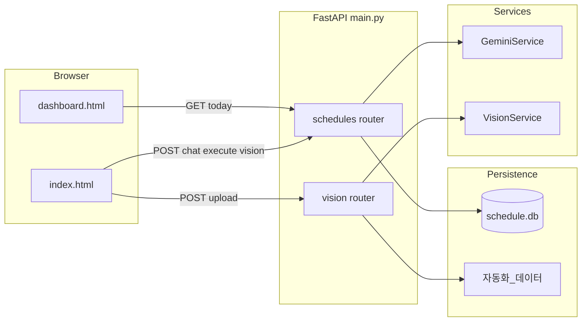

# yjs_Dashboard 저장소 전체 기획안

## 1. 제품 목적 (한 줄)

**현장 작업자가 자연어(채팅)로 일정을 등록·수정·삭제·조회하고, 작업일지 등 이미지를 업로드하면 AI가 분류·추출해 파일로 저장하며, 상황판 HTML이 SQLite 일정을 주기적으로 갱신해 보여주는 내부용 웹 앱.**

---

## 2. 기술 스택

| 구분  | 선택                                                                                                                                                                                                                                                                                             |
| --- | ---------------------------------------------------------------------------------------------------------------------------------------------------------------------------------------------------------------------------------------------------------------------------------------------- |
| 백엔드 | Python, **FastAPI**, Pydantic v2, `pydantic-settings`                                                                                                                                                                                                                                          |
| DB  | **SQLite** (`schedule.db`), `sqlite3` 직접 사용                                                                                                                                                                                                                                                    |
| AI  | **Google GenAI** (`google.genai`), 모델명 `gemini-3-flash-preview` ([`app/services/ai_service.py`](../app/services/ai_service.py), [`app/services/vision_ai_service.py`](../app/services/vision_ai_service.py)) |
| 프론트 | 루트의 **정적 HTML** + Bootstrap 5 CDN + 인라인 JS ([`index.html`](../index.html), [`dashboard.html`](../dashboard.html))                                                                                            |
| 기타  | 비전 업로드 후 **pandas**로 xlsx 저장 ([`app/api/vision.py`](../app/api/vision.py))                                                                                                                                                                                |

앱 진입점은 **저장소 루트의** [`main.py`](../main.py)입니다 (주석에는 `app/main.py`로 적혀 있으나 실제 파일 위치는 루트).

---

## 3. 디렉터리·역할 맵 (수정할 때 찾기 쉬운 표)

| 경로                                                                                                                   | 역할                                                          |
| -------------------------------------------------------------------------------------------------------------------- | ----------------------------------------------------------- |
| [`main.py`](../main.py)                                                     | FastAPI 앱 생성, CORS, 라우터 마운트, `/`·`/dashboard.html` 정적 파일 서빙 |
| [`app/api/schedules.py`](../app/api/schedules.py)                           | 일정 API: `/chat`, `/execute`, `/today`                       |
| [`app/api/vision.py`](../app/api/vision.py)                                 | 이미지 업로드·분석·`자동화_데이터/` 저장                                    |
| [`app/db/db_manager.py`](../app/db/db_manager.py)                           | `field_schedules` 테이블 CRUD/검색, 마이그레이션성 `ALTER`              |
| [`app/services/ai_service.py`](../app/services/ai_service.py)               | 자연어 → 의도·JSON 스키마 (`ActionSchema`, `ScheduleSchema`)        |
| [`app/services/vision_ai_service.py`](../app/services/vision_ai_service.py) | 이미지 → 문서종류·ERP용 필드 JSON                                     |
| [`app/core/config.py`](../app/core/config.py)                               | `.env` 기반 설정 (`GEMINI_API_KEY`, `DATABASE_URL`)             |
| [`index.html`](../index.html)                                               | 채팅 UI, `/api/schedules/`*, `/api/vision/upload` 호출          |
| [`dashboard.html`](../dashboard.html)                                       | 상황판 UI, `/api/schedules/today` 폴링(30초)                      |
| `schedule.db`                                                                                                        | 런타임 SQLite (`.gitignore`에 `*.db`)                           |
| `자동화_데이터/`                                                                                                           | 비전 파이프라인 결과물(문서종류별 폴더, xlsx·원본 이미지)                         |

`app/` 아래에 `__init__.py`가 없어도 Python 3에서 패키지로 import 되는 환경에서 동작하도록 구성된 형태입니다.

---

## 4. 엔드포인트 요약

| Method | Path                     | 처리 모듈          | 설명                                           |
| ------ | ------------------------ | -------------- | -------------------------------------------- |
| GET    | `/`                      | `main.py`      | `index.html`                                 |
| GET    | `/dashboard.html`        | `main.py`      | `dashboard.html`                             |
| POST   | `/api/schedules/chat`    | `schedules.py` | Gemini 의도 분석 + (필요 시) DB 후보 검색, **DB 변경 없음** |
| POST   | `/api/schedules/execute` | `schedules.py` | 사용자 확인 후 create/update/delete **실제 반영**      |
| GET    | `/api/schedules/today`   | `schedules.py` | 상황판용 일정 목록 (최대 50건)                          |
| POST   | `/api/vision/upload`     | `vision.py`    | 이미지 분석 후 디스크 저장                              |

OpenAPI는 FastAPI 기본 (`/docs` 등)으로 노출 가능.

---

## 5. 데이터·제어 흐름 (다이어그램)

**대화형 일정(V2) 패턴:** `chat`에서 `intent`·`candidates`·`schedule_data`만 돌려주고, 사용자가 카드에서 확인하면 `execute`로 한 번 더 호출해 DB를 바꿉니다. 삭제는 후보의 `id`로 `delete_schedule_by_id`를 호출합니다.

---

## 6. 데이터 모델

### 6.1 SQLite `field_schedules` (`db_manager._init_db` in [`app/db/db_manager.py`](../app/db/db_manager.py))

- `id`, `date`, `location`, `task`, `person`, `details`, `tags`, `category`, `created_at`
- **Upsert 규칙:** 동일 `(date, location)`이 있으면 UPDATE, 없으면 INSERT (`upsert_schedule`)

### 6.2 AI가 다루는 일정 스키마 (`ScheduleSchema` in [`app/services/ai_service.py`](../app/services/ai_service.py))

- 날짜·위치·작업·담당·상세·태그 리스트·카테고리(공사일정/이슈보고/일반메모 등)

### 6.3 비전 분석 스키마 (`AnalysisResult` in [`app/services/vision_ai_service.py`](../app/services/vision_ai_service.py))

- 문서 종류, 공사명/코드, 작업일, 야간 여부, 인원·장비 수치 등 → 작업일지인 경우 xlsx 한 행으로 변환

---

## 7. 환경 변수 ([`app/core/config.py`](../app/core/config.py))

- **필수:** `GEMINI_API_KEY`, `DATABASE_URL` (Pydantic Settings 상 필수 필드로 선언됨)
- **실사용:** 일정 경로는 코드에서 `**DBManager(db_path="schedule.db")`로 고정** ([`app/api/schedules.py`](../app/api/schedules.py)) — `DATABASE_URL`은 현재 일정 SQLite 경로와 **연결되어 있지 않음**.

`.env`는 [`.gitignore`](../.gitignore)에 포함.

---

## 8. 프론트엔드와 API 계약 (개조 시 체크포인트)

- [`index.html`](../index.html): `POST /api/schedules/chat` body `{ text }`; `POST /api/schedules/execute` body `{ action, schedule_data?, schedule_id? }`; `POST /api/vision/upload` `FormData` 필드명 `file`.
- [`dashboard.html`](../dashboard.html): `GET /api/schedules/today` → 응답의 `data` 배열을 날짜별 그룹으로 렌더. 우측 “외출/행선표”, “이달의 공지”는 **하드코딩 HTML**이라 API와 무관.

---

## 9. 현재 코드베이스 특이사항·기술 부채 (개조 전에 알면 좋은 것)

1. **`get_todays_schedules`의 쿼리 파라미터 `date`**: 라우터는 `date`를 넘기지만, [`get_all_schedules_desc`](../app/db/db_manager.py)는 SQL에서 `target_date`를 **사용하지 않음** (주석에도 “날짜 필터 없음”). “오늘만 보기” 등을 원하면 DB 레이어·API를 맞춰야 함.
2. **`insert_worklog` / `work_logs`**: DB 초기화에 `work_logs` 테이블이 없고, 다른 모듈에서도 호출되지 않음 — **미완성 또는 레거시**로 보는 것이 안전.
3. **CORS `allow_origins=["*"]`**: 배포 시 보안·도메인 정책을 다시 잡을 여지가 있음 ([`main.py`](../main.py)).
4. **의존성 목록**: 루트에 `requirements.txt` / `pyproject.toml`이 검색되지 않았음 — 재현·배포를 위해 잠금 파일을 두는 것이 일반적.

---

## 10. “이 방향으로 바꿀 때” 빠른 찾기 가이드

| 바꾸고 싶은 것             | 우선 볼 파일                                                                                                                                                                                                    |
| -------------------- | ---------------------------------------------------------------------------------------------------------------------------------------------------------------------------------------------------------- |
| AI 말투·의도 분류·필드 정의    | [`app/services/ai_service.py`](../app/services/ai_service.py) (시스템 프롬프트, `ActionSchema` / `ScheduleSchema`)                                                       |
| 일정 API URL·검증·응답 형식  | [`app/api/schedules.py`](../app/api/schedules.py)                                                                                                                 |
| 테이블 스키마·쿼리·Upsert 규칙 | [`app/db/db_manager.py`](../app/db/db_manager.py)                                                                                                                 |
| 이미지 분류·추출 필드·저장 규칙   | [`app/services/vision_ai_service.py`](../app/services/vision_ai_service.py), [`app/api/vision.py`](../app/api/vision.py) |
| 채팅/상황판 UI·폴링 주기      | [`index.html`](../index.html), [`dashboard.html`](../dashboard.html)                                                     |
| 라우트 추가·CORS·정적 경로    | [`main.py`](../main.py)                                                                                                                                           |
| 환경 변수·배포 설정          | [`app/core/config.py`](../app/core/config.py) + `.env`                                                                                                            |

이 문서는 저장소의 아키텍처·기술 부채 지도로 유지합니다. 동작이나 경로가 크게 바뀌면 함께 갱신하세요.

---

## 11. vNext 발전 기획안 (1~4차 통합)

### 11.1 목표

현장 사용자가 쉬운 입력 방식으로 데이터를 남기고, AI는 보조 역할에 집중하며, 최종 변경은 관리자 승인 정책으로 안전하게 운영한다.

### 11.2 제품 원칙

- **사용성 우선**: 비 IT 사용자 기준의 단순 UX(큰 버튼, 카테고리 선택, 확인 카드)
- **정확성 우선**: `id` 기반 변경, 중복 방지, 관리자 승인 큐
- **운영 단순화**: 1인 개발자 유지보수 가능한 단일 앱 구조
- **일별 보관**: 날짜 기준으로 Drive/xlsx 자동 업로드

### 11.3 인증/접근 정책

- 로그인은 **DB `id/pw`** 방식 사용
- 식별자는 **등록 코드(register code)** 기반
- 미등록 기기에서 앱 실행 시 `"미등록 기기입니다"` 메시지 후 클라이언트 종료
- 서버의 접근 차단 로직은 최소화하고, 비정상 패킷은 서버 검증 로직으로 방어

### 11.4 AI 권한 및 채팅 정책

- AI는 **일정 등록(create), 조회(search), 요약 생성** 중심으로 사용
- 수정/삭제는 채팅에서 즉시 반영하지 않고 **관리자 승인 큐**로 전송
- 해석 불가 채팅은 `unclassified`로 저장 후 관리자 처리
- 채팅 내역은 `daily_reset + recent 8~12` 권장
- 비용/지연 임계치 초과 시:
  - `"현재 AI를 사용할 수 없습니다. 관리자에게 문의해주세요"` 안내 출력

### 11.5 채팅 입력 카테고리

모바일/PC 채팅창 하단에서 카테고리 선택 후 전송:

- `공사 일정 등록` (기본값)
- `메모`
- `기타`
- `수정` (수정 요청)
- `삭제` (삭제 요청)

처리 규칙:

- `공사 일정 등록`, `메모`: AI 분석 후 등록 플로우
- `기타`: 관리자 `unclassified` 탭으로 전송
- `수정`, `삭제`: 사용자 요청으로 접수만 하고 관리자 승인 후 반영

### 11.6 디바이스별 UX

- **모바일**: 개인 채팅 중심, 등록/수정요청/삭제요청 + 대시보드 조회
- **PC**: 채팅 + 대시보드 동시 사용, 등록/조회/수정요청/삭제요청
- **LG Create Board**:
  - 채팅창 없음, 상황판 상시 출력
  - 카드 상태 UI 클릭 시 템플릿 입력창으로 조작
  - 사용자 식별 불가 시 변경자 표시는 `"전자칠판"`

### 11.7 일정/메모/외출 도메인 규칙

- 일정은 `start_date`, `end_date`로 연속 공사 표현
- 날짜 메모/공사 메모는 `memo_items` 단일 테이블 + `linked_schedule_id` 링크 방식
- 외출 상태는 `사무실(기본) / 외출 / 야간작업` 3종 유지
- 외출 만료 시 자동 복귀, 관리자 강제 상태 변경 시 기존 외출 상태 종료

### 11.8 중복 및 삭제 제어

- 중복 방지 2단계:
  1. 정규화 키 비교(날짜 범위, 현장명, 카테고리)
  2. 유사도 점수(`task/details`)
- 임계치 이상이면 신규 생성 전 사용자 확인 카드 노출
- 삭제는 기본 소프트 삭제(`deleted_at`, `deleted_by`, `delete_reason`)
- 하드 삭제는 관리자 페이지에서만 수행

### 11.9 사진 전송 기능 (4차)

- 대상: **모바일/PC 채팅창**
- 흐름:
  1. `사진 전송` 클릭
  2. `"어떤 사진을 전송하시겠습니까?"` 안내 + 카테고리 선택
  3. 예: `TBM 문서`, `공사 일지 문서`, `영수증` (추후 확장)
  4. 사진 첨부 후 전송
- 저장:
  - 대시보드에는 이미지 미표시
  - 카테고리별 폴더에 자동 저장 (`YYYY-MM-DD/<category>/...`)
  - `photo_uploads` 메타데이터 저장 (`category`, `file_path`, `uploaded_by`, `uploaded_device`, `uploaded_at`, `related_date`)
- 관리자 페이지에서 카테고리/날짜/업로더 기준 검색 및 다운로드 지원

### 11.10 데이터 저장/이력 추적/일별 업로드

- 모든 등록/수정/삭제요청/상태변경에 최종 변경자 기록:
  - `last_actor_user`, `last_actor_device`, `last_actor_at`
- 날짜 변경 시 전일 데이터 자동 업로드:
  - 공사일정
  - 기타메모
  - 인원별 외출
  - 야간작업 시작/종료 시각

### 11.11 권장 vNext 테이블

- `users`, `user_devices`, `sessions`
- `field_schedules` (vNext: `start_date`, `end_date`, `version`, actor 필드 추가)
- `memo_items`, `outing_records`
- `chat_threads`, `chat_messages`
- `admin_requests`, `audit_events`, `export_jobs`
- `photo_uploads`

### 11.12 단계적 로드맵

1. 인증 단순화(`id/pw + 등록 코드 + 세션`)
2. 카테고리 기반 채팅 UX
3. AI 권한 축소 + 관리자 승인 큐
4. Postgres 전환 + `id/version` + 중복 방지
5. 메모/외출/상태머신 + 최종 변경자 기록
6. 사진 전송 + 카테고리 폴더 저장
7. 날짜 전환 자동 업로드
8. 모바일/PC/Create Board 통합 QA
